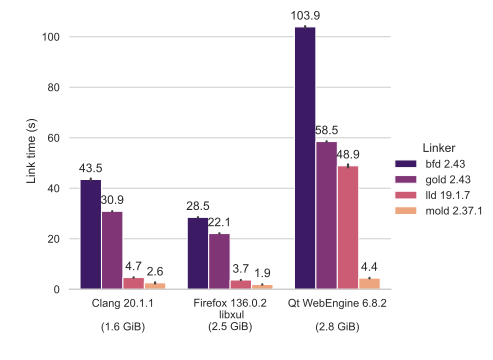

# Linker benchmarks
## Test system
* Intel(R) Core(TM) i9-9880H CPU @ 2.30GHz
* 32 GiB RAM
* KXG6AZNV1T02 NVMe SED TOSHIBA 1024GB
* Fedora release 37 (Thirty Seven)

## Results
### Memory use

### Link times

